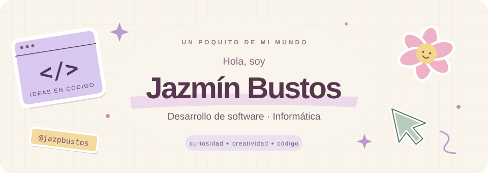

  

  <code>desarrollo web</code> &nbsp;✦&nbsp; <code>software</code> &nbsp;✦&nbsp; <code>inteligencia artificial</code>

## `$ whoami`

Soy **Jazmín Bustos**, estudiante avanzada de **Licenciatura en Informática** y **Técnica en Programación**.

  

## `$ cat stack.yaml`

<table>
  <tr>
    <td width="50%" valign="top">
      <h3>01 / Frontend</h3>
      
      
<code>HTML5 · CSS3 · JavaScript</code>

    </td>
    <td width="50%" valign="top">
      <h3>02 / Backend</h3>
      
      
<code>PHP · Python · Java</code>

    </td>
  </tr>
  <tr>
    <td width="50%" valign="top">
      <h3>03 / Bases de datos</h3>
      
      
<code>MySQL · PostgreSQL · Supabase</code>

    </td>
    <td width="50%" valign="top">
      <h3>04 / CMS</h3>
      
      
<code>WordPress · Elementor</code>

    </td>
  </tr>
</table>

## `$ connect --socials`

  
  &nbsp;
  

<!-- Portfolio: activar cuando esté listo — https://jazminbustos.vercel.app/ -->

Aprender, crear y seguir explorando. ✦ @jazpbustos

